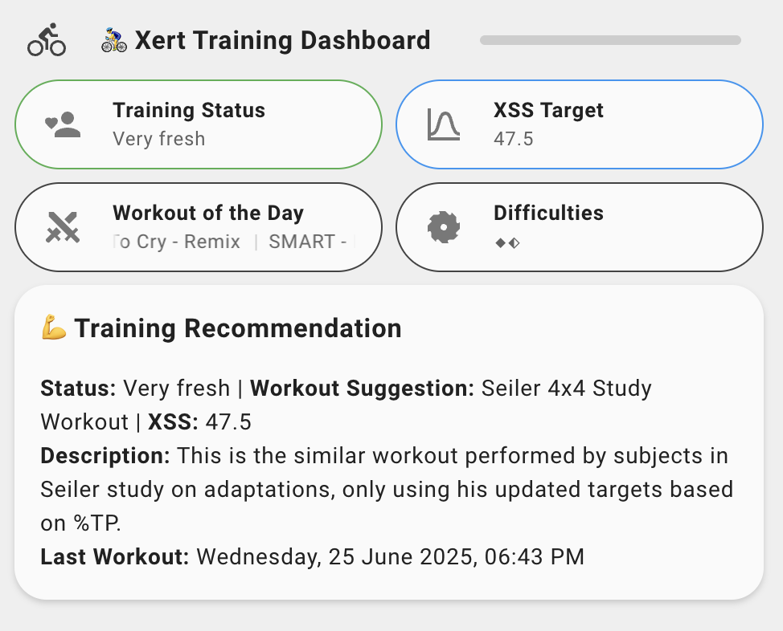

[](https://github.com/hacs/integration)
[](https://my.home-assistant.io/redirect/hacs_repository/?owner=salihinsaealal&repository=xert-homeassistant&category=integration)
[](https://my.home-assistant.io/redirect/integration/?domain=xert)
[](https://github.com/salihinsaealal/xert-homeassistant)
[](https://coff.ee/salihin)

Integrate your [Xert Online](https://www.xertonline.com/) fitness and training data directly into [Home Assistant](https://www.home-assistant.io/).

## Features
- OAuth2 authentication with Xert Online
- **🎉 NEW: Seamless re-authentication** - No need to delete/re-add integration when tokens expire!
- 6 sensor entities:
  - Fitness Status
  - Training Progress
  - Workout Manager
  - Recent Activity
  - Token Status
  - Workout of the Day (WOTD)
- **🎉 NEW: Services** for manual data refresh and workout downloads
- **🎉 NEW: Diagnostics platform** for easy troubleshooting
- Automatic token refresh with persistence
- Proactive token refresh (1 hour before expiry)
- Data updates every 15 minutes
- Beautiful dashboard-ready entities with Bubble Card support

## Dashboard Example
<center></center>
- Difficulties in this image is converted into diamond level indicator using helper in HomeAssistant.

## Installation

### Prerequisites
1. Install [Bubble Card](https://github.com/Clooos/Bubble-Card) from HACS Frontend if you want to use the example dashboard

### HACS (Recommended)
1. Open HACS in your Home Assistant instance
2. Go to the three dots menu (⋮) in the top right corner
3. Select "Custom repositories"
4. Add this repository URL: `https://github.com/salihinsaealal/xert-homeassistant`
5. Select category: "Integration"
6. Click "Add"
7. Search for "Xert Online" in HACS > Integrations
8. Click "Download"
9. Restart Home Assistant

### Manual
1. Copy the `xert` folder to your `config/custom_components/` directory
2. Restart Home Assistant

## Configuration
1. Go to **Settings > Devices & Services** in Home Assistant.
2. Click **Add Integration** and search for **Xert Online**.
3. Enter your Xert Online username and password.
4. Complete the setup.

## Entities and Attributes
| Entity | State | Key Attributes |
|--------|-------|---------------|
| `sensor.[username]_fitness_status` | Training Status | *(none)* |
| `sensor.[username]_training_progress` | 0 | `weight`, `signature_ftp`, `signature_ltp`, `signature_hie`, `signature_pp`, `tl_low`, `tl_high`, `tl_peak`, `tl_total`, `target_xss_low`, `target_xss_high`, `target_xss_peak`, `target_xss_total`, `source`, `success` |
| `sensor.[username]_wotd` | Workout Name | `type`, `description`, `workout_id`, `url`, `difficulty` |
| `sensor.[username]_workout_manager` | Number of Workouts | `total_workouts`, `last_modified`, `sample_workouts` |
| `sensor.[username]_recent_activity` | Activity Name | `activity_date`, `activity_timezone`, `activity_timestamp`, `activity_type`, `description`, `path` |
| `sensor.[username]_token_status` | Token Validity | `token_expiry`, `refresh_token_available`, `last_successful_call` |

## Example Dashboard YAML

The example dashboard YAML has been moved to a separate file for better readability and maintenance. You can find it here:

[`dashboard_example.yaml`](dashboard_example.yaml)

> This example uses the Bubble Card custom component for a beautiful, modern UI. Replace `[username]` with your Xert username.

## Services

### xert.refresh_data
Manually refresh all Xert data immediately.

```yaml
service: xert.refresh_data
```

Or refresh a specific integration:
```yaml
service: xert.refresh_data
data:
  entry_id: "your_entry_id_here"
```

### xert.download_workout
Download a workout file in ZWO or ERG format.

```yaml
service: xert.download_workout
data:
  workout_id: "vovdxww5i7fzqbun"
  format: "zwo"  # or "erg"
```

## Troubleshooting

### Re-authentication
If your tokens expire, Home Assistant will automatically prompt you to re-authenticate:
1. Go to **Settings → Devices & Services**
2. Look for the Xert integration with a "Configure" button
3. Click **Configure** and enter your password
4. Done! No need to delete and re-add the integration

### Token Issues
- Check `sensor.[username]_token_status` for current token state
- Token automatically refreshes 1 hour before expiry
- If you see "Token refresh failed: 400", the reauth flow will trigger automatically

### Debug Logging
Enable debug logging in `configuration.yaml`:
```yaml
logger:
  default: warning
  logs:
    custom_components.xert: debug
```

### Diagnostics
Download diagnostics for troubleshooting:
1. Go to **Settings → Devices & Services**
2. Click on the Xert integration
3. Click the three dots menu (⋮)
4. Select **Download diagnostics**

### Support
- For integration issues, open an issue on [GitHub](https://github.com/salihinsaealal/xert-homeassistant/issues)
- For Xert account issues, contact [Xert support](mailto:support@xertonline.com)

## Privacy
- OAuth tokens are stored locally and refreshed automatically
- No training data is stored beyond current values

## Version History
- **2.0.0** - 🎉 Major update: Seamless re-authentication, token persistence, services, diagnostics, enhanced error handling
- **1.0.5** - Fixed HACS icon display issues, updated icon and logo files
- **1.0.2** - Add recommended workout and details to workout_manager sensor; entity IDs now use username prefix
- **1.0.1** - Bugfixes, entity_id prefix, improved docs, and dashboard example
- **1.0.0** - Initial release with basic sensor entities

See [CHANGELOG.md](CHANGELOG.md) for detailed release notes.

## License
MIT 