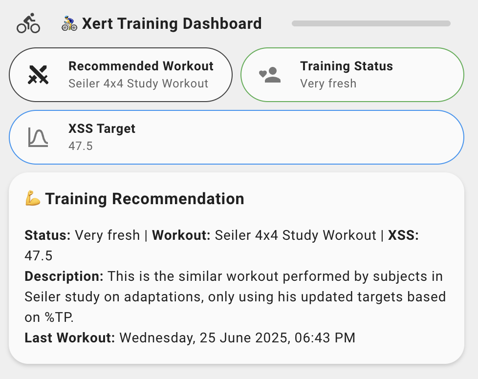

# Xert Online Home Assistant Integration

[](https://github.com/custom-components/hacs)
[](https://github.com/salihinsaealal/xert-homeassistant)

Integrate your [Xert Online](https://www.xertonline.com/) fitness and training data directly into [Home Assistant](https://www.home-assistant.io/).

## Features
- OAuth2 authentication with Xert Online
- 5 sensor entities:
  - Fitness Status
  - Training Progress
  - Workout Manager
  - Recent Activity
  - Token Status
- Automatic token refresh
- Data updates every 15 minutes
- Beautiful dashboard-ready entities with Bubble Card support

## Dashboard Example


## Installation

### Prerequisites
1. Install [Bubble Card](https://github.com/Clooos/Bubble-Card) from HACS Frontend if you want to use the example dashboard

### HACS (Recommended)
1. Open HACS in your Home Assistant instance
2. Go to the three dots menu (⋮) in the top right corner
3. Select "Custom repositories"
4. Add this repository URL: `https://github.com/salihinsaealal/xert-homeassistant`
5. Select category: "Integration"
6. Click "Add"
7. Search for "Xert Online" in HACS > Integrations
8. Click "Download"
9. Restart Home Assistant

### Manual
1. Copy the `xert` folder to your `config/custom_components/` directory
2. Restart Home Assistant

## Configuration
1. Go to **Settings > Devices & Services** in Home Assistant.
2. Click **Add Integration** and search for **Xert Online**.
3. Enter your Xert Online username and password.
4. Complete the setup.

## Entities and Attributes
| Entity | State | Key Attributes |
|--------|-------|---------------|
| `sensor.[username]_fitness_status` | Training Status | *(none)* |
| `sensor.[username]_training_progress` | 0 | `weight`, `signature_ftp`, `signature_ltp`, `signature_hie`, `signature_pp`, `tl_low`, `tl_high`, `tl_peak`, `tl_total`, `target_xss_low`, `target_xss_high`, `target_xss_peak`, `target_xss_total`, `source`, `success` |
| `sensor.[username]_wotd` | Workout Name | `type`, `description`, `workout_id`, `url`, `difficulty` |
| `sensor.[username]_workout_manager` | Number of Workouts | `total_workouts`, `workout_names`, `recommended_workout_name`, `recommended_workout_description`, `recommended_workout_type`, `recommended_workout_difficulty`, `last_modified` |
| `sensor.[username]_recent_activity` | Activity Name | `activity_date`, `activity_timezone`, `activity_timestamp`, `activity_type`, `description`, `path` |
| `sensor.[username]_token_status` | Token Validity | `token_expiry`, `refresh_token_available`, `last_successful_call` |

## Example Dashboard YAML

> This example uses the Bubble Card custom component for a beautiful, modern UI. Replace `[username]` with your Xert username.

```yaml
type: vertical-stack
cards:
  - type: custom:bubble-card
    card_type: separator
    name: 🚴‍♂️ Xert Training Dashboard
    icon: mdi:bike
    styles: |
      .bubble-line {
        background: var(--primary-color);
        opacity: 0.2;
      }
      .bubble-icon {
        color: var(--primary-color);
      }
  - type: horizontal-stack
    cards:
      - type: custom:bubble-card
        card_type: button
        entity: sensor.[username]_wotd
        name: Workout of the Day
        icon: mdi:sword-cross
        show_name: true
        show_icon: true
        show_state: true
        show_attribute: true
        attribute: name
        tap_action:
          action: more-info
        styles: |
          .bubble-button-card-container {
            background: var(--ha-card-background, var(--card-background-color));
            border: 1px solid var(--primary-color);
          }
          .bubble-icon {
            color: var(--primary-color);
          }
        button_type: name
      - type: custom:bubble-card
        card_type: button
        entity: sensor.[username]_fitness_status
        name: Training Status
        icon: mdi:account-heart
        show_name: true
        show_icon: true
        show_state: true
        tap_action:
          action: more-info
        styles: |
          .bubble-button-card-container {
            background: var(--ha-card-background, var(--card-background-color));
            border: 1px solid var(--green-color);
          }
          .bubble-icon {
            color: var(--green-color);
          }
        button_type: name
  - type: custom:bubble-card
    card_type: button
    entity: sensor.[username]_training_progress
    name: XSS Target
    icon: mdi:chart-bell-curve
    show_name: true
    show_icon: true
    show_state: false
    show_attribute: true
    attribute: target_xss_total
    tap_action:
      action: more-info
    styles: |
      .bubble-button-card-container {
        background: var(--ha-card-background, var(--card-background-color));
        border: 1px solid var(--blue-color);
      }
      .bubble-icon {
        color: var(--blue-color);
      }
    button_type: name
  - type: markdown
    content: >
      ### 💪 Training Recommendation

      **Status:** {{ states('sensor.[username]_fitness_status') }} | **Workout:**
      {{ state_attr('sensor.[username]_wotd', 'name') }} | **XSS:** {{
      state_attr('sensor.[username]_training_progress', 'target_xss_total') | round(2)
      }}

      **Description:** {{ state_attr('sensor.[username]_wotd', 'description') }}

      **Last Workout:** {{ (state_attr('sensor.[username]_recent_activity',
      'activity_date') | as_datetime + timedelta(hours=8)).timestamp() |
      timestamp_custom('%A, %d %B %Y, %I:%M %p') }}
```

### How to Use
1. Install [Bubble Card](https://github.com/Clooos/Bubble-Card) from HACS Frontend
2. Copy the YAML above
3. In Home Assistant, go to your dashboard, click the three dots (⋮) → Edit Dashboard → Add Card → Manual
4. Paste the YAML and save
5. Replace `[username]` with your Xert username

## Troubleshooting
- Check `sensor.[username]_token_status` for API/auth issues
- Enable debug logging in `configuration.yaml`:
  ```yaml
  logger:
    default: warning
    logs:
      custom_components.xert: debug
  ```
- For Xert account issues, contact [Xert support](mailto:support@xertonline.com)

## Privacy
- OAuth tokens are stored locally and refreshed automatically
- No training data is stored beyond current values

## Version History
- **1.0.5** - Fixed HACS icon display issues, updated icon and logo files
- **1.0.2** - Add recommended workout and details to workout_manager sensor; entity IDs now use username prefix
- **1.0.1** - Bugfixes, entity_id prefix, improved docs, and dashboard example
- **1.0.0** - Initial release with basic sensor entities

## License
MIT 